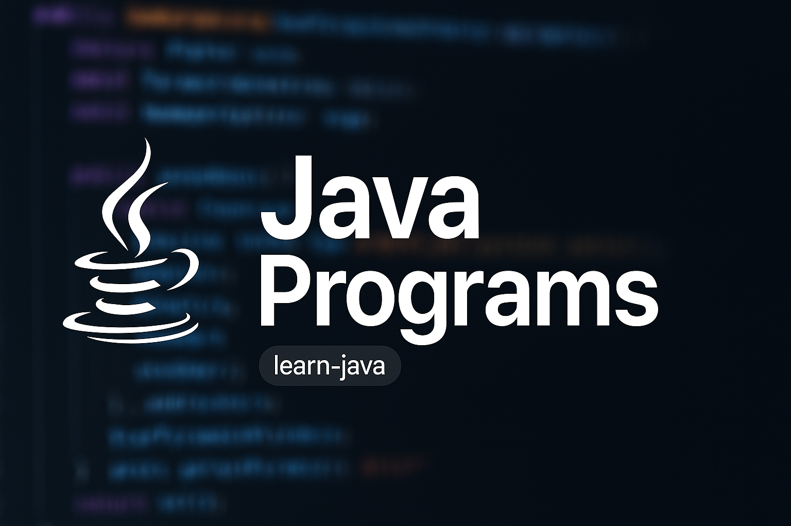

# Java Programs

> 📌 **Support the project:** If you like this repository, please give it a ⭐ on GitHub — it helps others find it!

  
  
  
  

A collection of beginner-friendly Java programs to help understand core Java concepts.  
This repository covers fundamental programming exercises including star patterns, number operations, and string manipulations.

---

## 📂 Folder Structure

📦 learn-java  
 ┣ 📜 javaprogramL.png         # Project banner image  
 ┣ 📜 README.md               # Project documentation  
 ┗ 📂 programs  
 ┃ ┣ 📜 EvenNumber.java  
 ┃ ┣ 📜 PrimeNumber.java  
 ┃ ┣ 📜 RadiusOfCircle.java  
 ┃ ┣ 📜 StringReverse.java  
 ┃ ┣ 📜 TableOfNumber.java 

 
 ┃ ┗📂Patterns
 
 ┃   ┣ 📜 HalfPyramid.java  
 ┃   ┣ 📜 HollowRectangle.java  
 ┃   ┣ 📜 InverstedHalfPyramid.java  
 ┃   ┣ 📜 SolidRectangle.java  
 ┃   ┣ 📜 Pattern5.java  
 ┃   ┣ 📜 Pattern6.java  
 ┃   ┣ 📜 Pattern_7.java  
 ┃   ┣ 📜 Floyd's_triangle  
 ┃   ┗ 📜 triangle_pattern  

-----

## 📂 Programs List

### ⭐ Pattern Programs (`programs/Patterns`)

| File | Description |
|------|-------------|
| [HalfPyramid.java](programs/Patterns/HalfPyramid.java) | ⭐ Prints a half pyramid star pattern. |
| [HollowRectangle.java](programs/Patterns/HollowRectangle.java) | ⬛ Prints a hollow rectangle pattern. |
| [InverstedHalfPyramid.java](programs/Patterns/InverstedHalfPyramid.java) | 🔻 Prints an inverted half pyramid star pattern. |
| [SolidRectangle.java](programs/Patterns/SolidRectangle.java) | 🟥 Prints a solid rectangle pattern. |
| [Pattern5.java](programs/Patterns/Pattern5.java) | 🔢 Prints a number-based star pattern (custom logic). |
| [Pattern6.java](programs/Patterns/Pattern6.java) | 🔢 Another variation of number/star pattern. |
| [Pattern_7.java](programs/Patterns/Pattern_7.java) | ⭐ Additional star pattern program. |
| [Floyd's_triangle](programs/Patterns/Floyd's_triangle) | 🔼 Prints Floyd's triangle pattern. |
| [triangle_pattern](programs/Patterns/triangle_pattern) | 🔼 Prints a simple triangle pattern. |

---

### 🔢 Number Programs

| File | Description |
|------|-------------|
| [EvenNumber.java](programs/EvenNumber.java) | ⚖️ Checks if a number is even or odd. |
| [PrimeNumber.java](programs/PrimeNumber.java) | 🔍 Checks if a number is prime. |
| [TableOfNumber.java](programs/TableOfNumber.java) | 📊 Prints the multiplication table of a given number. |

---

### 🛠️ Math & Utility Programs

| File | Description |
|------|-------------|
| [RadiusOfCircle.java](programs/RadiusOfCircle.java) | 📏 Calculates the area (and circumference) of a circle using radius. |
| [StringReverse.java](programs/StringReverse.java) | 🔄 Reverses a given string. |

---

## 🚀 How to Run

### **Run a Single Program**
1. Clone this repository:
       
   git clone https://github.com/Los-Angeless/learn-java.git
     
2. Open the folder in your Java IDE (e.g., IntelliJ IDEA, Eclipse, VS Code).
3. Compile and run any Java program:
       
   javac FileName.java
   java FileName
     

---

## 🤝 Contributing

Contributions are welcome!  
If you want to add more Java programs or improve existing ones:

1. **Fork** the repository  
2. **Create a new branch**  
       
   git checkout -b feature-new-program
     
3. **Add your program** in the appropriate folder (`programs` or a new category)  
4. **Commit your changes**  
       
   git commit -m "Added [Your Program Name]"
     
5. **Push to your fork**  
       
   git push origin feature-new-program
     
6. **Create a Pull Request** on GitHub

---

## 👀 Visitor Count

  

---

## 📌 About
This repository is intended for beginners who want to practice Java programming and improve problem-solving skills.

---
**Author:** Nishant Wagharalkar  
**License:** MIT License
